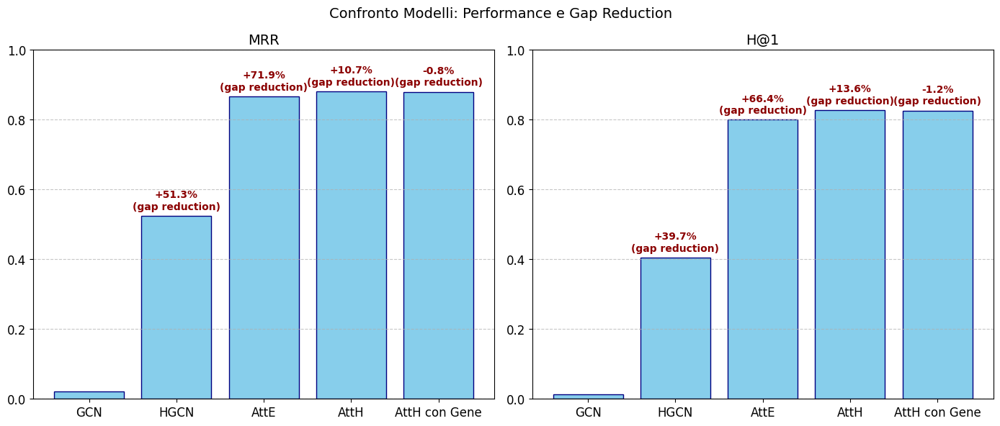

# PATIENT KNOWLEDGE GRAPH REPRESENTATION USING NON-EUCLIDEAN METRIC
### Analisi delle tecniche di Machine Learning applicate a embedding di dati ottenuti tramite applicazione di metriche non euclidee, al fine di supportare la diagnosi delle malattie mendeliane.
### La ricerca si è divisa in 3 studi:
#### - Analisi dell'impatto che ha la scelta dello spazio di rappresentazione (euclideo vs iperbolico)
#### - Analisi dell'impatto che ha la scelta del tipo di modello (omogenei vs eterogenei)
#### - Studio della coerenza biomedica dei dati utilizzati tramite inserimento dei nodi Gene al grafo già utilizzato, al fine di valutarne l'impatto nelle performance dei modelli

### Risultato finale tramite confronto della riduzione del gap di errore:

  

### L'articolo scientifico che presenta tutto lo studio e le tecniche relative alla ricerca è [**qua**](https://github.com/moroa01/Tesi-magistrale/blob/main/Moretti_Andrea_Tesi.pdf)
### Il codice utilizzato per lo studio e l'implementazione di modelli è presente [**qua**](https://github.com/moroa01/Tesi-magistrale/tree/main/Code)

### Librerie utilizzate:
### - HazyResearch: [**hgcn**](https://github.com/HazyResearch/hgcn)
### - HazyResearch: [**KGEmb**](https://github.com/HazyResearch/KGEmb)
