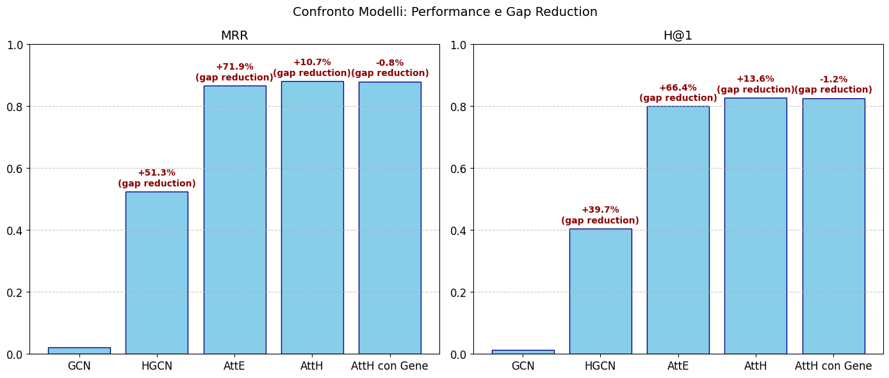

# Patient Knowledge Graph Representation Using Non-Euclidean Metrics

Master’s thesis focused on the analysis of Machine Learning techniques applied to embeddings generated from non-Euclidean spaces, with the objective of improving diagnostic support for Mendelian diseases through graph-based patient representations.

The research investigates how the geometric structure of embedding spaces and the topology of biomedical knowledge graphs influence representation quality and downstream predictive performance.

---

# Research Objectives

The study is divided into three main analyses:

## 1. Representation Space Analysis
Evaluation of the impact of the embedding space geometry:
- Euclidean space
- Hyperbolic space

The goal is to understand how non-Euclidean geometries affect the representation of hierarchical biomedical relationships.

---

## 2. Graph Model Analysis
Comparison between different graph architectures:
- Homogeneous graph models
- Heterogeneous graph models

The analysis evaluates how graph structure influences learning capability and predictive accuracy.

---

## 3. Biomedical Consistency Analysis
Extension of the original graph through the integration of **Gene nodes** in order to evaluate:
- biomedical coherence of the graph
- biological consistency of learned representations
- impact on model performance

---

# Final Results

Comparison of the models through error-gap reduction analysis:

  

---

# Resources

- Scientific article and complete thesis:
  [Moretti_Andrea_Tesi.pdf](https://github.com/moroa01/Tesi-magistrale/blob/main/Moretti_Andrea_Tesi.pdf)

- Source code and model implementations:
  [Code Directory](https://github.com/moroa01/Tesi-magistrale/tree/main/Code)

---

# Technologies and Libraries

- Python
- PyTorch
- Graph Neural Networks (GNNs)
- Knowledge Graph Embeddings
- Hyperbolic Geometry

### External Libraries
- HazyResearch — [hgcn](https://github.com/HazyResearch/hgcn)
- HazyResearch — [KGEmb](https://github.com/HazyResearch/KGEmb)

---

# Research Areas

- Machine Learning
- Knowledge Graphs
- Hyperbolic Embeddings
- Geometric Deep Learning
- Biomedical AI
- Computational Biology
- Rare Disease Diagnosis
